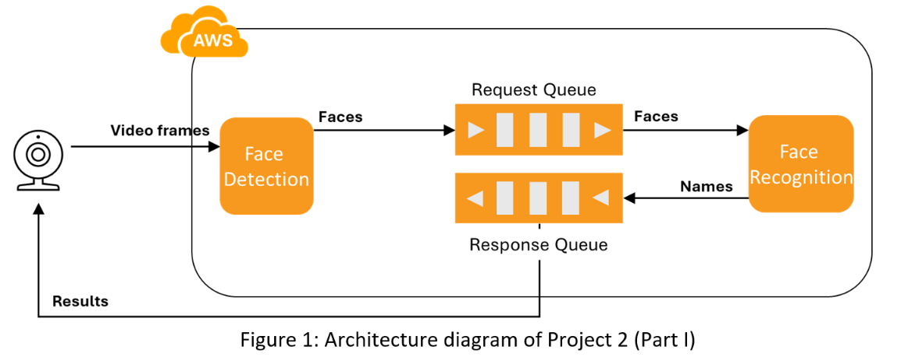

# Part 1 — Serverless Face Detection & Recognition (AWS Lambda)

Two AWS Lambda functions, each packaged as a Docker container image built on the
official `public.ecr.aws/lambda/python:3.10` base image:

- **`face-detection`** (`files_for_image/fd_lambda.py` + `utils.py`) — runs
  `facenet_pytorch.MTCNN` on an input image to detect and crop a face, then
  forwards the cropped face to the recognition function via SQS.
- **`face-recognition`** (`files_for_image/fr_lambda.py` + `utils.py`,
  `face-recognition/lamda_function.py`) — loads a traced ResNet/FaceNet model
  (`resnetV1.pt`) and a set of precomputed face embeddings
  (`resnetV1_video_weights_1.pt`), embeds the detected face, and returns the
  closest matching identity by Euclidean distance.

Both functions share the same Docker image/dependencies but override the
Lambda `CMD` handler (`fd_lambda.face_detection_handler` vs.
`fr_lambda.face_recognition_handler`) — see `Dockerfile` (top-level, generic)
and `files_for_image/Dockerfile` (the actual image used to build/push).

## Architecture Diagram



## Layout

```
Dockerfile                       # container build, generic version
files_for_image/
  Dockerfile                    # build used for the deployed image
  fd_lambda.py                   # face-detection Lambda handler
  fr_lambda.py                   # face-recognition Lambda handler
  utils.py                       # FaceDetection / FaceRecognition helper classes
  requirements.txt                # Python dependencies
  test/
    test_fd.py                   # local test for face-detection handler
    test_fr.py                   # local test for face-recognition handler
face-recognition/
  lamda_function.py               # earlier/alternate face-recognition handler
commands_to_run.txt               # runbook: build/push/deploy/test commands (secrets redacted)
```

## Not included (excluded on purpose)

- `resnetV1.pt`, `resnetV1_video_weights_1.pt` — trained model weights /
  precomputed face embeddings (~107 MB + ~180 KB). Too large for a normal git
  repo and not something to publish blindly. Regenerate/export your own traced
  FaceNet model and embeddings, or fetch them from wherever the class provided
  them, and drop them into `files_for_image/` before building the image.
- `aws-lambda-rie` — the AWS Lambda Runtime Interface Emulator binary used for
  local testing. Download it from AWS docs:
  https://github.com/aws/aws-lambda-runtime-interface-emulator
- `test/fd_request.json`, `outputs/` — sample request/response data.
- `__pycache__/` — build artifacts.

## Setup

1. Install Docker.
2. Get/create model files `resnetV1.pt` and `resnetV1_video_weights_1.pt` and
   place them in `files_for_image/`.
3. Download `aws-lambda-rie` into `files_for_image/` if you want to test the
   image locally before deploying.
4. Build the image:
   ```
   cd files_for_image
   docker build -t project-2-part-1-lambda:latest .
   ```
5. Push to an AWS ECR repository and create/update two Lambda functions
   (`face-detection`, `face-recognition`) pointing at that image, overriding
   the handler per function. See `commands_to_run.txt` for the exact CLI
   commands (AWS account ID and other identifiers are placeholders — fill in
   your own).
6. Test locally with `aws-lambda-rie` (see `commands_to_run.txt`) before
   deploying, or invoke the deployed Lambda functions directly.
